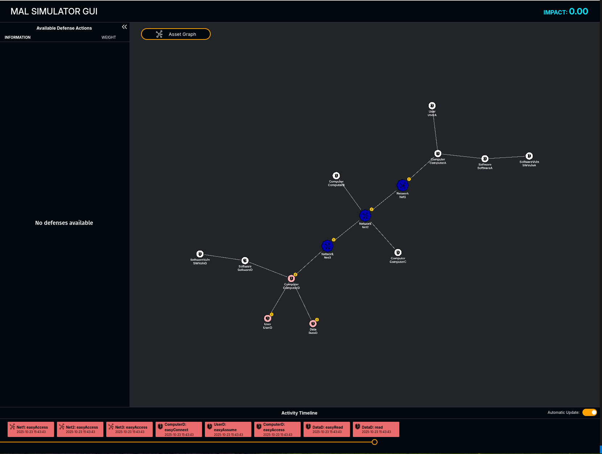

# MAL Simulator

## Overview

A MAL compliant simulator.

## Installation

```pip install mal-simulator```

To also get ML dependencies (pettingzoo, gymnasium):

```pip install mal-simulator[ml]```

For additional dev tools:

```pip install mal-simulator[dev]```

## Contributing

- Use [Conventional commits](https://www.conventionalcommits.org/en/v1.0.0/)
- The CI pipeline runs `mypy` and `ruff` for linting and type checking, and PRs will only be merged if pipeline succeeds.

## MalSimulator

A `mal_simulator.MalSimulator` can be created to be able to run simulations.

### MalSimulatorSettings
The MalSimulator can be given a settings (`mal_simulator.MalSimulatorSettings`)
through the parameter 'sim_settings'. Giving sim_settings is optional, otherwise default settings are used.

```python

settings = MalSimulatorSettings(
    # Default values
    uncompromise_untraversable_steps: bool = False
    ttc_mode: TTCMode = TTCMode.DISABLED
    seed: Optional[int] = None
    attack_surface_skip_compromised: bool = True
    attack_surface_skip_unviable: bool = True
    attack_surface_skip_unnecessary: bool = True
    run_defense_step_bernoullis: bool = True
    attacker_reward_mode: RewardMode = RewardMode.CUMULATIVE
    defender_reward_mode: RewardMode = RewardMode.CUMULATIVE
)
sim = MalSimulator(attack_graph, sim_settings=settings, ...)

```

## Scenarios

A scenario defines everything required to run a simulation:

- MAL language
- MAL model (inline or via file)
- Agent settings (attackers and defenders)
- Optional reward and node-property rules (observability, actionability, false-positive/negative rates)

Scenarios can be defined in YAML or built programmatically as malsim.scenario.Scenario objects.

### Scenario fields

Scenario files support only the fields listed below.

Required fields:
- lang_file
- one of: model_file or model
- one of: agent_settings or agents

Allowed fields:
- rewards
- observable_steps
- actionable_steps
- false_positive_rates
- false_negative_rates


### Scenario class structure

```python
class Scenario:
    def __init__(
        self,
        lang_file: str,
        model: Model | dict[str, Any] | str,
        agent_settings: dict[str, AttackerSettings | DefenderSettings],
        rewards: Optional[dict[str, Any]] = None,
        false_positive_rates: Optional[dict[str, Any]] = None,
        false_negative_rates: Optional[dict[str, Any]] = None,
        observable_steps: Optional[dict[str, Any]] = None,
        actionable_steps: Optional[dict[str, Any]] = None,
    ):
        ...
```

### Example scenario file
```yml
extends: <path to another scenario>   # optional
lang_file: <path to .mar archive>
model_file: <path to model file>     # or use `model:` instead of `model_file`

agents:
  attacker1:
    type: attacker
    policy: BreadthFirstAttacker
    entry_points:
      - "Credentials:6:attemptCredentialsReuse"
    goals:
      - "Host A:fullAccess"
    config:
      seed: 1
    actionable_steps:
      by_asset_type:
        Host:
          - access

  defender1:
    type: defender
    policy: DefendCompromisedDefender
    observable_steps:
      by_asset_name:
        User_3:
          - phishing

```

### Node property rule structure

All rule sections (rewards, observable_steps, actionable_steps, false_positive_rates, false_negative_rates) follow the same pattern:

```yml
rewards:
  by_asset_type:
    Host:
      access: 10
  by_asset_name:
    User_3:
      phishing: 5
```

Rules can specify either:
lists → treated as “True” for those nodes
dictionaries → mapping <step> → <value>

### Extending Scenarios

Instead of copy pasting an entire scenario file it is possible to extend the scenario and only override
specific values. Use the `extends` key pointing to another scenario. All keys present in the extending
scenario will override the settings in the original (extended) scenario when you load the extending scenario.

### Loading a scenario from a python script

#### Load attack graph and config

If you just want to load a scenario from a file, use `malsim.scenario.Scenario`.

```python
from malsim import Scenario

scenario = Scenario.load_from_file("scenario.yml")
```

#### Load simulator and config

If you want to create a simulator from a scenario, use `MalSimulator.from_scenario`.

```python
from malsim import Scenario, MalSimulator

scenario = Scenario.load_from_file("scenario.yml")
mal_simulator = MalSimulator.from_scenario(scenario)
```
The returned MalSimulator contains the attackgraph created from the scenario, as well as registered agents.
At this point, the simulator and the scenario agents can be used for running a simulation

(use or refer to function `malsim.mal_simulator.run_simulation` to create your own simulation loop).
`run_simulation` will return the paths each agent took during the simulation.

If you want deterministic simulations, give `sim_settings` with a seed to the MalSimulator,
and seed to agents in the scenario files.

```python
from malsim import (
    MalSimulator,
    MalSimulatorSettings,
    run_simulation,
    Scenario,
)

scenario = Scenario.load_from_file("scenario.yml")
sim = MalSimulator.from_scenario(
    scenario,
    sim_settings=MalSimulatorSettings(seed=10),
)

paths = run_simulation(sim, scenario.agent_settings)
```

## Agent settings

Attacker and defender agents are important for running simulations in the MAL Simulator.

### Attacker settings
type: "attacker"
entry_points: set of step names
goals: optional set of target steps
policy: name of agent class
config: passed to agent constructor
actionable_steps: NodePropertyRule
rewards: NodePropertyRule

### Defender settings

type: "defender"
policy
config
rewards
observable_steps
actionable_steps
false_positive_rates
false_negative_rates

## Rewards

Reward functions are important, especially for ML implementations.
Reward values can be set either in a scenario or by giving `rewards` to the MalSimulator.

RewardMode can be either CUMULATIVE or ONE_OFF, this is set through the MalSimulatorSettings given to MalSimulator (`sim_settings`). Default is CUMULATIVE.

By default:

- Attacker is rewarded for compromised nodes
- Defender is penalized for compromised nodes and enabled defenses

If a user wants to implement their own custom reward function, the current recommendation is to:

- Create a class that inherits MalSimulator
- Override methods:
  - `_attacker_step_reward`
  - `_defender_step_reward`

These methods are run to generate a reward every step for each agent (`MalSimAgentState`),
and they are defined like this:

```python
    def _attacker_step_reward(
        self,
        attacker_state: MalSimAttackerState,
        reward_mode: RewardMode,
    ) -> float:

    def _defender_step_reward(
        self,
        defender_state: MalSimDefenderState,
        reward_mode: RewardMode
    ) -> float:
```

## CLI

### Running a scenario simulation with the CLI

```
usage: malsim [-h] [-o OUTPUT_ATTACK_GRAPH] [-s SEED] [-t TTC_MODE] [-g] scenario_file

positional arguments:
  scenario_file         Can be found in https://github.com/mal-lang/malsim-scenarios/

options:
  -h, --help            show this help message and exit
  -o OUTPUT_ATTACK_GRAPH, --output-attack-graph OUTPUT_ATTACK_GRAPH
                        If set to a path, attack graph will be dumped there
  -s SEED, --seed SEED  If set to a seed, simulator will use it as setting
  -t TTC_MODE, --ttc-mode TTC_MODE
                        0: EFFORT_BASED_PER_STEP_SAMPLE
                        1: PER_STEP_SAMPLE
                        2: PRE_SAMPLE
                        3: EXPECTED_VALUE
                        4: DISABLED
  -g, --send-to-gui     If set, simulator will send actions to malsim-gui
  ```

This will create an attack graph using the configuration in the scenarios file, apply the rewards, register the agents and run the simulation.

## Running the simulator without the CLI

To run a more customized simulator or use wrappers/gym envs, you must write your own simulation loop.

To initialize the MalSimulator you either need a scenario file or an attack graph loaded through some other means.

### Initializing simulator programatically with a scenario file

The regular simulator works with attack graph nodes and keeps track on agents state with those.

```python
from malsim import MalSimulator, run_simulation, Scenario

logging.basicConfig() # Enable logging

SCENARIO_FILE = "tests/testdata/scenarios/traininglang_scenario.yml"
scenario = Scenario.load_from_file(SCENARIO_FILE)
sim = MalSimulator.from_scenario(scenario) # Can provide settings here
agent_actions = run_simulation(sim, scenario.agents)

```

## Running the VectorizedEnv (serialized observations)

You can run the vectorized without gymnasium to receive serialized observations.

```python

import logging
from typing import Optional

from malsim import Scenario, MalSimulator
from malsim.envs import MalSimVectorizedObsEnv

logging.basicConfig() # Enable logging

scenario_file = "tests/testdata/scenarios/traininglang_scenario.yml"
scenario = Scenario.load_from_file(scenario_file)

# The vectorized obs env is a wrapper that creates serialized observations
# for the simulator, similar to how the old simulator used to work, tailored
# for use in gym envs.
vectorized_env = MalSimVectorizedObsEnv(MalSimulator.from_scenario(scenario))

# Run reset after agents are registered
obs, info = vectorized_env.reset()

# You need to write your own simulator loop:
while not vectorized_env.sim.done():
    actions: dict[str, tuple[int, Optional[int]]] = {}

    for agent in scenario.agents:
        vectorized_agent_info = info[agent['name']] # Contains action mask which can be used
        regular_agent_info = vectorized_env.sim.agent_states[agent['name']] # Also contains action mask
        action = next(iter(regular_agent_info.action_surface))

        if action:
            actions[agent['name']] = (1, vectorized_env.node_to_index(action))
        else:
            actions[agent['name']] = (0, None)

    obs, rew, term, trunc, info = vectorized_env.step(actions)


```

## Running the Gym envs

You can run the gym envs.

```python
import logging

import gymnasium as gym
from gymnasium.spaces import MultiDiscrete, Dict

from malsim.envs.gym_envs import register_envs

# Enable logging to stdout
logging.basicConfig()

env_name = "MALDefenderEnv"
scenario_file = "tests/testdata/scenarios/traininglang_scenario.yml"
register_envs()
env: gym.Env[Dict, MultiDiscrete] = gym.make(
    env_name,
    scenario_file=scenario_file
)

# info contains serialized action mask
obs, info = env.reset()

# Simulation loop
term = False
while not term:
    # Sample an action from action space
    serialized_action = env.action_space.sample(info['action_mask'])
    obs, rew, term, trunc, info = env.step(serialized_action)
```


## TTCs

TTC (Time to compromise) can be enabled with the `sim_settings` ttc_mode option.
TTCs can be defined in the MAL language for attack steps as probability distributions.
- TTCs for attack steps tells the difficulty to compromise a step in the mal-simulator.

Defense steps can also have TTCs, but they are interpreted differently.
- TTCs for defense steps tells the probability that the defense is enabled at the start of a simulation.
- Always Bernoullis. (Enabled = Bernoulli(1), Disabled=Bernoulli(0))

[Read more about TTCs](https://github.com/mal-lang/malcompiler/wiki/Supported-distribution-functions)

In the MalSimulator, TTCs can be used in different ways (set through malsim settings)

1. EFFORT_BASED_PER_STEP_SAMPLE
  - Run a random trial and compare with the success probability of an attack step after n attempts.
  - Let the agent compromise if the trial succeeds

2. PER_STEP_SAMPLE
  - Sample the distribution for an attack step each time an agent tries to compromise a step
  - Let agent compromise a node if the sampled value is <= 1

3. PRE_SAMPLE
  - Sample the distribution for each attack step at the beginning of a simulation and decrement it every step an agent tries to compromise it
  - Let agent compromise a node if the ttc value is < 1

4. EXPECTED VALUE
  - Set the ttc value of a step to the expected value at the beginning of a simulation and decrement it every step an agent tries to compromise it
  - Let agent compromise a node if the ttc value is < 1

5. DISABLED (default)
  - Don't use TTCs, all attack steps are compromised on the agents first attempt (as long as they are allowed to)

### Bernoullis in attack steps

If an attack step has a Bernoulli in its TTC, it will be sampled at the start of the simulation.
If the Bernoulli does not succeed, the step will not be compromisable.

This is to match the  https://github.com/mal-lang/malcompiler/wiki/Supported-distribution-functions#bernoulli-behaviour

## Node properties in the MAL Simulator

To implement the MAL logic, a few additional properties have been added to nodes in the MAL simulator.

### Viability

We want to determine which attack steps are possible to compromise in the attack graph with respect to the state of `defense`/`exist`/`notExist` steps. We call that property viability. To get the viability of an attack step, we look at its parents' viability.
Some attack steps have `defense`/`exist`/`notExist` steps as parents. The viability of those steps is determined by whether they are enabled/have their conditions met or not.
In this way the viability propagates from `defense`/`exist`/`notExist` steps to attack steps and indicates whether the attack steps are viable based on current `defense`/`exists`/`notExist` statuses.

[See implementation](https://github.com/mal-lang/mal-simulator/blob/0144efd78d78b606ab25c74a73675e00dafd4887/malsim/graph_processing.py#L147)

Attack steps:
- Viability on attack steps represents whether it is possible to compromise with respect to the state of the attack graphs `defense`/`exist`/`notExist` steps.
  - An `AND`-step is viable if all of its (necessary) parents are viable. Otherwise it is unviable.
  - An `OR`-step is viable if any of its parents are viable. Otherwise it is unviable.
  - An attack step with an uncertain TTC (i.e. it includes a Bernoulli distribution) is unviable if its Bernoulli sampling 'fails' (optional with setting `run_attack_step_bernoullis`).

- Viability on defense steps represents whether they are enabled or not and is used to propagate viability to their child attack steps.
  - A disabled `defense` step is viable (which means it is not making any of its children unviable)
  - An enabled `defense` step is unviable (which means it makes its AND-children unviable)
  - A `defense` step can be pre-enabled based on its TTC (optional with setting `run_defense_step_bernoullis`)

- Viability on `exist`/`notExist` steps is also used to propagate viability to its children.
  - if an `exist` step has any of its requirements met it is viable. It will be unviable if
none of its requirements are present.
  - if a `notExist` step has any of its requirements met it is not viable. It will be viable
if none of its requirements are present.


### Necessity

We want to know whether an attacker needs to compromise an (`OR`/`AND`) attack step to progress (to its children). This concept is called necessity.

[See implementation](https://github.com/mal-lang/mal-simulator/blob/0144efd78d78b606ab25c74a73675e00dafd4887/malsim/graph_processing.py#L52)

Why are not all nodes necessary?

**Answer**: To allow structures in the attack graph where steps are required in some but not all conditions.

**Example**: If you have encrypted data, you must first decrypt them in order to access them. However, if they’re not encrypted you can access the data directly, meaning that the decryption step is unnecessary

Attack steps:
  - An `OR`-step with all of parents necessary is necessary. If not all parents are necessary, the `OR`-node is unnecessary.
  - An `AND`-step with any parent necessary is necessary. If no parents are necessary the `AND`-node is unnecessary.

`defense` steps:
  - Enabled -> Necessary, Disabled -> Unnecessary

`exist` steps:
  - Necessary if it has none of its requirements met, otherwise unnecessary.

`notExist` steps:
  - Necessary if it has any of its requirements met, otherwise unnecessary.

Note: You can decide to ignore these rules effect on attack surfaces with settings:

- `attack_surface_skip_unnecessary`

### Compromised

A node becomes compromised by an attacker if:
1. The node is set as an entrypoint for the attacker.
2. The node is traversable for an attacker and the attacker decides to compromise it.

If TTCs are enabled, the compromise might require several attempts.

### Traversability

[Implementation](https://github.com/mal-lang/mal-simulator/blob/0144efd78d78b606ab25c74a73675e00dafd4887/malsim/mal_simulator.py#L417)

Traversability is a per-attacker node property. Based on an attackers previously compromised nodes, an additional node is traversable iff:
1. The node is viable
2. If node is type OR, at least one of its parents must be reached
3. If node is type AND, all of its necessary parents must be reached

If these are not true, the node is not traversable.

### Actionability / Observability

Actionability/observability are two additional options a node can have, and can be set in a scenario.

They do not affect viability or necessity, but act as a filter.

Observability means that a node is observed by a defender when it is compromised. Being observed in this case means it is added to the `MalSimDefenderState.observed_nodes`.

Actionability currently has no impact in the base simulator, but is used in Vejde MALSIM it controls whether a certain type of attack step can be used as an action by agents or not.


## GUI, Visualization (slightly experimental)



It is possible to view simulation runs graphically with the [malsim-gui](https://github.com/mal-lang/malsim-gui). Recommended way to run it is through docker:

`docker run -p 8888:8888 mrkickling/malsim-gui:0.0.0`

When you run simulations in the simulator, set `send_to_api=True` in the Malsimulator init or use the `-g` flag when running the simulator from command line.

This will show the model and the performed actions in the web GUI at http://localhost:8888.
