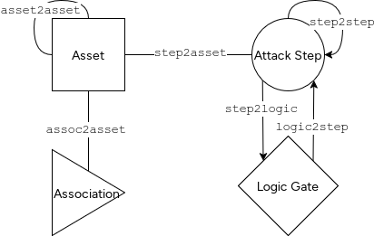

# Graphical Gym Interface

The Graphical Gym Interface provides a graph-structured observation and action space for the MAL simulator, designed for use with graph neural networks and other graph-based reinforcement learning algorithms.

## Overview

The interface represents the attack graph as a structured observation with nodes (assets, steps, associations, logic gates) and edges (relationships between nodes). This graph structure is encoded using Coordinate (COO) format for efficient representation and processing.

## Core Concepts

### Observation Structure (`MALObsInstance`)



The observation is a graph-structured representation of the current simulation state, containing:

#### Nodes

- **Assets**: Model assets with type and ID
- **Steps**: Attack/defense steps with type, ID, logic class, tags, compromised status, observable status, attempts, and action mask
- **Associations**: Relationships between assets (can be `None` if there are no associantions in the observation)
- **Logic Gates**: Representations of `&`/`|` logic for attack steps

#### Edges (COO Format)

All edges are stored in Coordinate (COO) format as 2D numpy arrays with shape `(2, N)` where:
- Row 0: Source node indices
- Row 1: Target node indices

The available edge types are:

- **`step2asset`**: Links between steps and assets (undirected)
- **`assoc2asset`**: Links between associations and assets (undirected, can be `None` if there are no associantions in the observation)
- **`step2step`**: Links between steps (directed)
- **`logic2step`**: Links from logic gates to steps (directed)
- **`step2logic`**: Links from steps to logic gates (directed)
- **`asset2asset`**: Links between assets (undirected)

Undirected edges only give one direction. If the other direction is needed, concatenate with transpose of the links.

### Action Spaces

The interface supports multiple action space representations:

#### Step-Based Action Spaces

- **`MALObsAttackStepSpace`**: Discrete space over actionable attack steps (AND/OR nodes)
  - Actions are indices into the sorted list of actionable attack steps
  - Assumes all `and`/`or` steps have lower indicies than `defense`/`exist`/`notExist`

- **`MALObsDefenseStepSpace`**: Discrete space over actionable defense steps
  - Actions are indices into the sorted list of defense steps
  - Assumes all `defense` steps have lower indicies than `and`/`or`/`defense`/`exist`/`notExist`

#### Asset-Action Tuple Spaces

These spaces allow selecting actions by combining assets and action types:

- **`AssetThenAction`**: Tuple space `(asset_index, action_type)`
  - First select an asset, then select an action type available for that asset
  - Supports both attacker and defender variants.
  - The attacker variant (`AssetThenAttackerAction`) assumes that the step types are serialized such that attacker actionable step types have lower index than other step types.
  - The defender variant (`AssetThenDefenderAction`) assumes that the step types are serialized such that defender actionable step types have lower index than other step types.

- **`ActionThenAsset`**: Tuple space `(action_type, asset_index)`
  - First select an action type, then select an asset that supports that action type
  - Supports both attacker and defender variants.
  - The attacker variant (`AttackerActionThenAsset`) assumes that the step types are serialized such that attacker actionable step types have lower index than other step types.
  - The defender variant (`DefenderActionThenAsset`) assumes that the step types are serialized such that defender actionable step types have lower index than other step types.

### Serialization (`LangSerializer`)

The `LangSerializer` maps language elements to numeric indices for use in observations and actions:

- **`step_type`**: Maps step types to indices (can be split by asset type)
- **`attacker_step_type`**: Attacker-specific step type indexing (prioritizes AND/OR steps)
- **`defender_step_type`**: Defender-specific step type indexing (prioritizes defense steps)
- **`step_class`**: Maps step logic classes (and, or, defense, exist, notExist) to indices
- **`step_tag`**: Maps step tags to indices
- **`asset_type`**: Maps asset types to indices
- **`association_type`**: Maps association types to indices

The serializer provides conversion arrays:
- **`step_type2attacker_step_type`**: Converts from general step_type to attacker_step_type
- **`step_type2defender_step_type`**: Converts from general step_type to defender_step_type

### Observation Types

- **`MALObs`**: Base observation space
- **`MALAttackerObs`**: Attacker observation space (requires `attempts` field)
- **`MALDefenderObs`**: Defender observation space (must NOT have `attempts` field)

### Environment Types

#### Single-Agent Environments

- **`MalSimAttackerGraph`**: Single-agent attacker environment
  - Wraps `MalSimGraph` to provide a single-agent interface
  - Action space: `MALObsAttackStepSpace`

- **`MalSimDefenderGraph`**: Single-agent defender environment
  - Wraps `MalSimGraph` to provide a single-agent interface
  - Action space: `MALObsDefenseStepSpace`

#### Multi-Agent Environment

- **`MalSimGraph`**: ParallelEnv for multi-agent scenarios
  - Supports both attacker and defender agents simultaneously
  - Each agent has its own observation and action space

### Action Space Wrappers

Wrappers can transform action spaces to different representations:

#### `AssetThenActionWrapper`

Transforms the action space from step indices to `(asset, action_type)` tuples:
- Input: `(asset_index, action_type)`
- Converts to step index by finding steps connected to the asset with matching action type

#### `ActionThenAssetWrapper`

Transforms the action space from step indices to `(action_type, asset)` tuples:
- Input: `(action_type, asset_index)`
- Converts to step index by finding steps with matching type connected to the asset

## Usage Example

```python
from malsim.envs.graph.graph_env import MalSimAttackerGraph
from malsim.envs.graph.wrapper import AssetThenActionWrapper
from malsim.scenario import Scenario

# Create environment
scenario = Scenario.load_from_file("scenario.yml")
env = MalSimAttackerGraph(scenario, sim_settings)

# Wrap to use asset-action tuple space
wrapped_env = AssetThenActionWrapper(
    env,
    model=env.sim.attack_graph.model,
    lang_serializer=env.multi_env.lang_serializer
)

# Reset and step
obs, info = wrapped_env.reset()
done = False
while not done:
    asset_mask, action_mask = wrapped_env.mask(obs)
    action = wrapped_env.action_space.sample(mask=(asset_mask, action_mask))
    obs, reward, terminated, truncated, info = wrapped_env.step(action)
    done = terminated or truncated
```

## Utils

Observation construction is handled by three key functions in `utils.py`:

- **`create_full_obs`**  
  Produces the full observation of the environment, including all assets, steps, associations, and graph connectivity, as the base for the other two functions.

- **`full_obs2attacker_obs`**  
  Constructs an attacker observation from a full observation, making only assets with compromised steps visible. All steps of the visible assets are visible to the attacker. Optionally includes defense steps of the visible assets.

- **`full_obs2defender_obs`**  
  Constructs a defender observation from a full observation, making all assets and steps visible. The defender can only know wether a step is compromised if it's observable.

## Key Design Decisions

1. **COO Format**: Edges use Coordinate format for efficient sparse graph representation
2. **Always Non-None**: `logic_gates`, `logic2step`, and `step2logic` are always present (empty arrays if no logic gates exist)
3. **Unidirectional Asset Links**: `asset2asset` edges are unidirectional (duplicate transpose if bidirectional needed)
4. **Split Step Types**: When `split_step_types=True`, step types are indexed per asset type for more granular control
5. **Actionability Masking**: Defense step space automatically applies actionability during sampling
